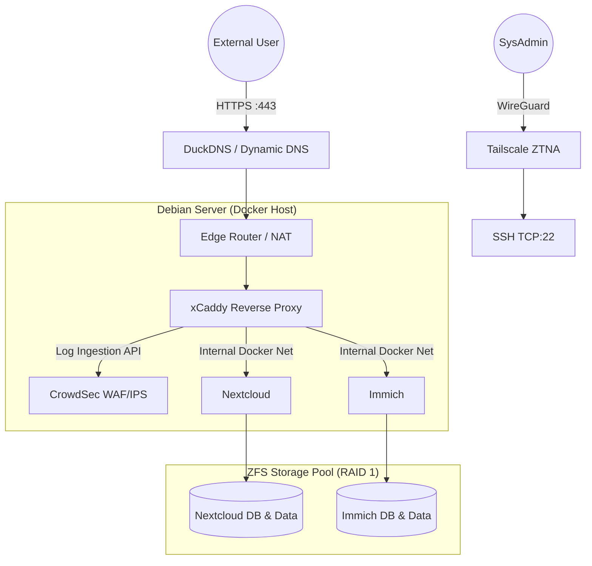

# Executive summary
Hey ! this is a guide on how to use Crowdsec and Caddy together to secure your Immich and Nextcloud services, all containerized with Docker.
**Read the full deep-dive and architectural breakdown on my portfolio: [Shakti-3xtorris Portfolio](https://portfolio.shakti-3xtorris.workers.dev/project/circe/)**

## Table of Contents
- [Key Features](#Key-Features)
- [Repository Structure](#Repository-Structure)
- [Architecture & Network Segregation](#architecture--network-segregation)
- [Prerequisites](#prerequisites)
- [Deployment Guide](#deployment-guide)
  - [1. Storage & Snapshots (ZFS + Sanoid)](#1-storage--snapshots-zfs--sanoid)
  - [2. Network Preparation](#2-network-preparation)
  - [3. Edge Security & Reverse Proxy (xCaddy + CrowdSec)](#3-edge-security--reverse-proxy-xcaddy--crowdsec)
  - [4. Application Stacks (Nextcloud & Immich)](#4-application-stacks-nextcloud--immich)
- [Operations & Troubleshooting](#operations--troubleshooting)

---
## Key Features
* **Reduced Attack Surface:** Eliminates public SSH exposure using Tailscale 
* **Active Threat Defense (WAF/IPS):** A custom xCaddy binary integrates with CrowdSec to block automated exploitation, brute-force attempts, and Layer 7 attacks (e.g., XSS, SQLi).
* **Containerized Isolation:** Services are deployed via Docker using a dedicated external network (`caddy_net_final`) to restrict internal routing.
* **Tamper-Proof  logs** Nextcloud and Caddy log volumes are mounted as read-only to the CrowdSec container, preventing unauthorized log modification if the container is breached.
* **Data Resilience:** ZFS storage pool in a RAID 1 mirror configuration with automated, granular rollback points managed by Sanoid. (this is fully optional)
## Repository Structure

```text
.
├── Caddy/
│   ├── Caddyfile
│   ├── docker-compose.yml
│   ├── Dockerfile
│   ├── .env.example
│   └── Crowdsec/
│       └── acquis.yaml
├── immich/
│   ├── docker-compose.yml
│   └── .env.example
└── nextcloud/
    ├── docker-compose.yml
    └── .env.example
```

## Architecture & Network Segregation

To ensure reliable reverse proxy targeting, the server relies on a static DHCP reservation at the edge router level and DuckDNS for lightweight Dynamic DNS (DDNS) routing.
The architecture : 


Port configuration : 

| Service | Internal Port | External Port | Exposure | Network Segregation |
| :--- | :--- | :--- | :--- | :--- |
| **SSH** | 22 | None | ZTNA (Tailscale) only | Host OS |
| **xCaddy** | 80/443 | 80/443 | Public Web | `caddy_net_final` |
| **Nextcloud**| 80 | None | Reverse Proxy only | `caddy_net_final` |
| **Immich** | 2283 | None | Reverse Proxy only | `caddy_net_final` |
---

## Prerequisites
* Any Linux distribution (i used Debian)
* Tailscale installed and authenticated
* Docker installed
* Registered domain/subdomains (e.g., via DuckDNS)
* Optional : RAID 1 configurated hdds (i used ZFS)

---
## Deployment Guide

### 1. (Optional) Storage & Snapshots (ZFS + Sanoid)
Create a RAID 1 mirror using specific disk IDs to prevent mounting errors if drives are physically swapped:
```bash
lsblk --nodeps -o name,serial # Find disk IDs
zpool create <pool_name> mirror /dev/disk/by-id/<disk1-id> /dev/disk/by-id/<disk2-id>

```

### 2. Network Preparation

Once you pulled the repo,
Create the shared external Docker network that links the reverse proxy to the application containers. This ensures services remain isolated while allowing Caddy to route traffic and CrowdSec to monitor logs :
```bash
docker network create caddy_net_final
```
### 3. Edge Security & Reverse Proxy (xCaddy + CrowdSec)

Because the standard Caddy binary does not natively support CrowdSec, you must compile a custom binary using `xcaddy`. The provided `Dockerfile` in the `/Caddy` directory handles this build process on its own, pulling the required Layer 4 and AppSec modules automaticaly.

Navigate to the /Caddy directory and generate your own CrowdSec Bouncer API key : 
```bash
cscli bouncers add caddy
```

Copy `.env.example` and change its name to `.env` and add your generated key.
then, build the container : 
```bash
docker compose up -d --build
```
Note: The `--build` flag is required to ensure any custom module updates to the xCaddy image are compiled during initialization.
### 3. Nextcloud & Immich

With the `caddy_net_final` network established and the reverse proxy listening, let's  deploy the application stacks.

Both `immich/docker-compose.yml` and `nextcloud/docker-compose.yml` are pre-configured to attach to the external network we custom made (caddy_net_final) :
```yaml
networks:
 caddy_net_final:
  external: true
```

Navigate to each respective directory, configure your `.env` variables from the provided examples, and bring up the containers:
```bash
docker compose up -d
```

## Operations & Troubleshooting

- **Validating WAF Rules:** To confirm the Caddy/CrowdSec integration is functioning, simulate a ban and verify traffic is dropped.
```bash
docker compose exec crowdsec cscli decisions add --range 0.0.0.0/0 --duration 15m
docker compose restart caddy
curl -4 -I http://localhost
docker compose exec crowdsec cscli decisions delete --range 0.0.0.0/0
```

. **CrowdSec Initialization Failures:** If CrowdSec logs an `invalid compose project` error regarding the Nextcloud volume, verify the external volume mapping in the CrowdSec `docker-compose.yml` precisely matches Docker's internal naming scheme for your Nextcloud deployment (e.g., `circe-nextcloud_nextcloud`).

. **WAF Real-Time Monitoring:** Parse Caddy's JSON logs with `jq` to monitor WAF block events as they happen (without jq the logs are just a text wall):
```bash
docker logs <caddy-container-name> 2>&1 | jq -R 'fromjson? // empty'
```
